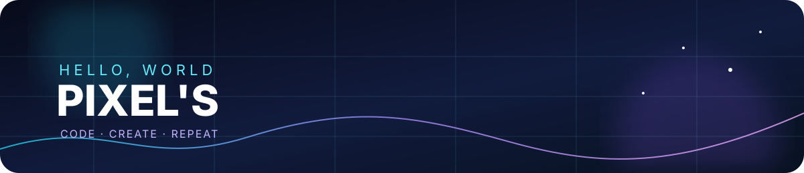
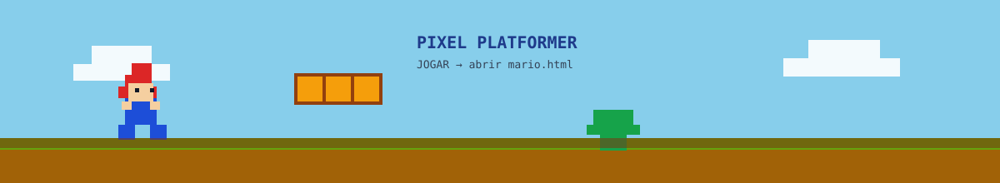

  

  <h1>Olá, eu sou o Pixel's 👋</h1>
  
<strong>Construindo experiências digitais com código, criatividade e curiosidade.</strong>

  

    
    
  

## ✦ Sobre mim

Sou uma pessoa apaixonada por tecnologia e desenvolvimento, sempre transformando ideias em projetos funcionais, bonitos e úteis. Gosto de aprender na prática, experimentar novas ferramentas e criar interfaces que combinam **clareza, personalidade e experiência**.

- 🚀 Explorando desenvolvimento web, automação e inteligência artificial
- 🧠 Aprendendo algo novo em cada projeto
- 🎨 Acredito que tecnologia boa também pode ser visualmente marcante
- 📍 Brasil · disponível para construir coisas interessantes

## 🧰 Tecnologias & ferramentas

## ✨ Projetos em destaque

| Projeto | O que é |
|:--|:--|
| [Marieli-lp](https://github.com/Rhuan22/Marieli-lp) | Landing page com interface elegante e integração com e-mail. |
| [gc-tandem](https://github.com/Rhuan22/gc-tandem) | Projeto colaborativo para experimentar novas ideias. |
| [JARVIS-chatbot](https://github.com/Rhuan22/JARVIS-chatbot) | Chatbot em Python com memória e integração com IA. |
| [Sitejudo](https://github.com/Rhuan22/Sitejudo) | Experiência web focada em apresentação e usabilidade. |

## 🕹️ Meu mini jogo

  
   
  <a href="https://htmlpreview.github.io/?https://raw.githubusercontent.com/Rhuan22/Rhuan22/main/mario.html"><strong>▶ Jogar agora no navegador</strong></a>

  Use as setas ou A/D para andar, Espaço/W/↑ para pular e pegue todas as moedas.

